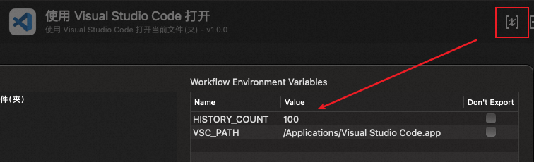

# Alfred-Workflow-Code

使用 Visual Studio Code 打开当前文件(夹)。

[⤓ 下载 Workflow](https://github.com/CYJB/Alfred-Workflow-Code/releases/latest/download/code.alfredworkflow)

## 使用方法

在访达中选择了某个文件或文件夹后，使用 `code` 命令将其在 Visual Studio Code 中打开。

文件会在当前 Visual Studio Code 实例中打开，文件夹会在新的实例中打开。

还支持保留之前打开的文件/文件夹历史记录，只要在命令后带上参数，就会根据参数筛选历史记录。历史记录默认保留 100 个，也可以根据需要自行配置。

## 配置

可以在 Workflow 的 "Configure workflow and variables" 中修改 Workflow 的配置，包括：

- `HISTORY_COUNT`：本地保留的历史记录个数，设置为 0 则不使用历史记录功能。
- `VSC_PATH`：Visual Studio Code 的安装路径。

